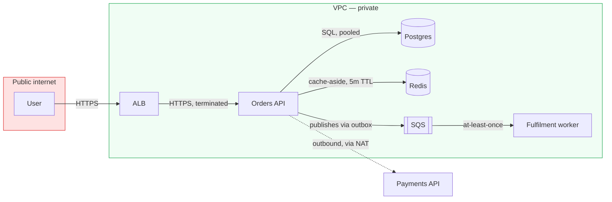

# Diagrams

## Purpose

Produce technical diagrams as text, so they live in version control, appear in code review, and can be corrected when the system changes — instead of a PNG in a wiki that was accurate two years ago.

## When to Use

- Documenting an architecture, a data flow, or a request path.
- Explaining a sequence of interactions between services.
- Visualizing a state machine or a decision flow.
- Adding a diagram to a README, an ADR, or a design document.

## Capabilities

- Mermaid: flowcharts, sequence diagrams, state diagrams, ER diagrams, Gantt.
- Diagram-type selection.
- Layout control and readability.
- Rendering to SVG or PNG for contexts that do not support Mermaid.

## Inputs

- The system, process, or interaction being described.
- The audience and what they need to understand from it.

## Outputs

- A diagram as text, in the repository, next to the code it describes.
- A rendered image, where the destination cannot render Mermaid.

## Workflow

1. **Choose the type by the question** — Sequence diagrams answer "what talks to what, in what order". Flowcharts answer "what are the paths through this". State diagrams answer "what states exist and how do you move between them". Using the wrong one produces a diagram that is technically correct and useless.
2. **Draw one thing** — A diagram showing the architecture, the data flow, and the deployment topology at once shows none of them.
3. **Label the edges** — An unlabelled arrow between two boxes conveys almost nothing. "publishes OrderPlaced" conveys a great deal.
4. **Keep it under about fifteen nodes** — Beyond that, it is a map, not a diagram, and nobody will read it.
5. **Put it in version control** — Next to the code. A diagram that is not reviewed alongside the change it describes will drift, silently.

## Best Practices

- A diagram that cannot be updated in a pull request will not be updated. That is the entire argument for diagrams-as-code over a drawing tool.
- Unlabelled arrows are the most common diagram defect. The relationship between two components is the information; the boxes are just anchors.
- Trust boundaries, when relevant, should be visible. A diagram that does not distinguish "inside our network" from "the public internet" is missing the thing that matters for a security review.
- Show the failure path, not just the happy one, in a sequence diagram of anything important. The interesting part of a payment flow is what happens when the gateway times out.
- Do not attempt to show every component. A diagram is an abstraction; if it were complete, it would be the code.
- Render to SVG for documentation sites — it scales and the text remains selectable.

## Examples

**A sequence diagram showing the failure path, which is the part that matters:**

```mermaid
sequenceDiagram
    autonumber
    participant C as Client
    participant API as Orders API
    participant P as Payments (3rd party)
    participant DB as Postgres
    participant Q as Outbox → SQS

    C->>API: POST /orders (Idempotency-Key)
    API->>DB: BEGIN; check idempotency key
    alt key already seen
        DB-->>API: existing response
        API-->>C: 200 (replayed, no double charge)
    else new request
        API->>P: authorize(amount)
        alt authorized
            P-->>API: 200 auth_id
            API->>DB: INSERT order + INSERT outbox(order.placed); COMMIT
            API-->>C: 201 Created
            Q->>Q: relay publishes order.placed
        else declined
            P-->>API: 402 card_declined
            API->>DB: ROLLBACK
            API-->>C: 402 Payment Required
        else timeout (the case that actually hurts)
            P--xAPI: no response after 5s
            API->>DB: ROLLBACK
            API-->>C: 503 + Retry-After
            Note over API,P: The charge may or may not have succeeded.<br/>Reconciliation job resolves it against the<br/>gateway within 15 minutes.
        end
    end
```

The timeout branch is the one worth diagramming. Everyone understands the happy path.

**A flowchart with labelled edges and a visible trust boundary:**



## Notes

- Every arrow here is labelled with what actually crosses it. The unlabelled version of this diagram — the same boxes, plain arrows — conveys roughly a tenth as much.
- Mermaid renders natively on GitHub, GitLab, and most documentation platforms. A diagram in a Markdown file is reviewed in the pull request alongside the code it describes, which is the only mechanism that keeps diagrams true.
- For a diagram that must be pixel-precise or heavily styled, Mermaid will frustrate you. Use it for the 95% of diagrams where accuracy and maintainability matter more than aesthetics.
